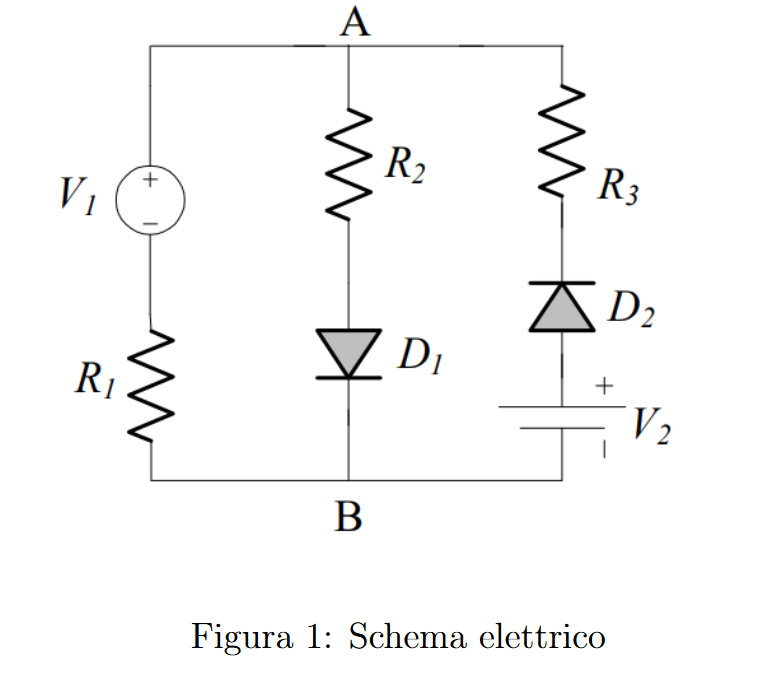

# Esercizio 1 – Analisi Circuitale con il Metodo degli Stati

[🏠 Torna alla Home](./) | [Esercizio 2 (Porta AND) →](esercizio2)

---

## 🔗 Soluzione Completa
Per vedere il documento originale con tutti i passaggi matematici estesi:
👉 **[Apri la soluzione su Overleaf](https://www.overleaf.com/read/wnhwjqmwqvvg#e56973)**

---

## 📐 1. Analisi dello Schema

Prima di iniziare i calcoli, osserviamo il circuito.

*(Fig. 1: Schema circuitale base. File: fig_esercizio1.png)*

> **💡 Guida alla lettura dello schema:**
> Abbiamo due generatori (**V1** e **V2**) che competono per far scorrere corrente nei diodi.
> * **V2** è fisso a **1V**.
> * **V1** cambia nei vari quesiti.
> * I diodi **D1** e **D2** funzionano come "valvole": permettono il passaggio solo in una direzione. Il nostro compito è capire quale "valvola" è aperta e quale è chiusa.

**Dati del problema:**
* Resistenze: **R1 = R2 = R3 = 1 kΩ**
* Generatore fisso: **V2 = 1 V**
* Soglia di accensione Diodo: **Von = 0.7 V**

---

## 🧠 2. Teoria: Il Metodo degli Stati

Non possiamo usare la legge di Ohm direttamente perché i diodi sono componenti non lineari. Usiamo il **Metodo degli Stati**:

1.  **IPOTESI:** Tiriamo a indovinare se i diodi sono ON (accesi) o OFF (spenti).
2.  **CIRCUITO EQUIVALENTE:** Disegniamo il circuito sostituendo i diodi:
    * **Diodo ON** → Sostituisci con **Batteria da 0.7V**
    * **Diodo OFF** → Sostituisci con **Interruttore Aperto**
3.  **CALCOLO:** Troviamo correnti e tensioni usando le leggi di Kirchhoff.
4.  **VERIFICA:** Controlliamo se i risultati hanno senso fisico:
    * Se ipotizzato ON: la corrente deve scorrere nel verso della freccia (**Id > 0**).
    * Se ipotizzato OFF: la tensione inversa non deve superare la soglia (**Vak < 0.7V**).

---

## 3️⃣ Caso A: Tensione V1 = 8 V

**Analisi Intuitiva:**
Il generatore V1 è molto forte (8V) rispetto a V2 (1V). Spingerà una forte corrente che attiverà sicuramente D1. D2 si troverà probabilmente con una tensione troppo alta al catodo per condurre.

**Ipotesi:** D1 **ON**, D2 **OFF**.

*(Fig. 2: Circuito equivalente con D1 sostituito da batteria 0.7V e D2 aperto)*

**Svolgimento:**
Essendo il ramo di D2 aperto, la corrente fluisce solo nella maglia esterna.
$$I_{D1} = \frac{V_1 - V_{ON}}{R_1 + R_2} = \frac{8V - 0.7V}{2k\Omega} = \mathbf{3.65 mA}$$

**Verifica:**
* La corrente Id1 è positiva? **Sì (3.65 mA)**.
* La tensione su D2 è minore di 0.7V? Calcoliamo il potenziale al nodo A:
  $$V_A = 0.7V + (R_2 \cdot I_{D1}) = 4.35V$$
  La tensione su D2 è: **1V - 4.35V = -3.35V**.
  È minore di 0.7V? **Sì**.

✅ **Soluzione Confermata.**

---

## 4️⃣ Caso B: Tensione V1 = 0 V

**Analisi Intuitiva:**
Ora V1 è a terra (0V). Il generatore dominante è V2 (1V). La corrente cercherà di scendere da V2 verso V1, attraversando D2.

**Ipotesi:** D1 **OFF**, D2 **ON**.

*(Fig. 3: Circuito equivalente con D2 sostituito da batteria 0.7V e D1 aperto)*

**Svolgimento:**
La corrente esce da V2, attraversa D2 e R1 e finisce a massa (V1).
$$I_{D2} = \frac{V_2 - V_{ON} - V_1}{R_3 + R_1} = \frac{1V - 0.7V - 0V}{2k\Omega} = \mathbf{0.15 mA}$$

**Verifica:**
* La corrente Id2 è positiva? **Sì**.
* D1 è spento? La tensione al nodo centrale è **Va = R1 * Id2 = 0.15V**.
  Questa tensione (0.15V) non basta ad accendere D1 (serve 0.7V). Quindi D1 resta OFF.

✅ **Soluzione Confermata.**

---

## 5️⃣ Casi Successivi (V1 = 1V e V1 = -10V)

Per esercizio, prova ad applicare lo stesso metodo logico:
* **V1 = 1V:** Situazione di equilibrio, ma D1 vince perché offre un percorso verso terra. (Risultato: D1 ON, D2 OFF).
* **V1 = -10V:** V1 "risucchia" tutta la corrente. D2 conduce, D1 è interdetto.

---

    

        <h2 id="q-title">🔒 Accesso Limitato: Verifica le tue conoscenze</h2>
        
Rispondi correttamente per sbloccare l'esercizio.

        

        
Caricamento domanda...

        

        

    

