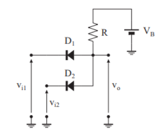

# Esercizio 2 – Linearizzazione con Thevenin

[🏠 Torna alla Home](./) | [🔍 Sorgente GitHub](https://github.com/luigipelagagge-oss/ElectroLab-La-Rassegna-Prove-del-Quarto-Anno)

---

## 🔗 Risorsa Fondamentale
Per la soluzione completa passo-passo, fai riferimento al documento ufficiale:
👉 **[Apri la soluzione dettagliata su Overleaf](https://www.overleaf.com/read/jgyynkpccmbm#287a89)**

---

## 📐 Schema del Circuito

*(Assicurati che il file immagine nella cartella si chiami esattamente esercizio2.png)*

---

## 🎯 Obiettivo
Determinare il punto di lavoro del diodo. Essendo inserito in una rete complessa, dobbiamo semplificare il circuito a monte usando il **Teorema di Thevenin**.

---

## ✍️ Formule per lo Svolgimento

Ecco i passaggi analitici per ottenere il circuito equivalente:

### 1. Calcolo di $V_{th}$
Il circuito senza diodo è un partitore di tensione. La tensione che il diodo "vedrebbe" ai suoi capi (A-B) prima di essere collegato è:

$$V_{th} = V_{in} \cdot \frac{R_2}{R_1 + R_2}$$

### 2. Calcolo di $R_{th}$
Spegnendo il generatore $V_{in}$ (collegandolo a massa), le resistenze $R_1$ e $R_2$ risultano in parallelo. Se c’è una resistenza $R_3$ in serie al ramo del diodo, questa va sommata al parallelo:

$$R_{eq} = (R_1 \parallel R_2) + R_3 = \frac{R_1 \cdot R_2}{R_1 + R_2} + R_3$$

---

<strong>✅ Clicca qui per la conclusione</strong>

 

### Analisi del Circuito Equivalente

Una volta ottenuti $V_{th}$ e $R_{eq}$, il circuito diventa una maglia elementare.

**Condizione di ON:**
Se $V_{th} > 0.7V$, il diodo conduce.

**Corrente nel Diodo:**
$$I_D = \frac{V_{th} - 0.7V}{R_{eq}}$$

---

**Navigazione:**
[← Esercizio 1 (Diodi)](esercizio1) | [Esercizio 3 (Darlington) →](esercizio3)
