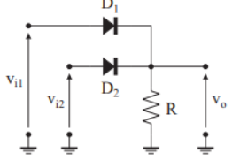

# Esercizio 3 – Forme d'Onda (Selettore di Massimo)

[🏠 Torna alla Home](./) | [🔍 Sorgente GitHub](https://github.com/luigipelagagge-oss/ElectroLab-La-Rassegna-Prove-del-Quarto-Anno)

---

## 🔗 Soluzione Completa
Per vedere i grafici dettagliati e lo svolgimento originale:
👉 **[Apri la soluzione ufficiale su Overleaf](https://www.overleaf.com/read/vwzzvdrpwfqh#f5e496)**

---

## 📐 Schema del Circuito

*(Circuito selettore di massimo con due diodi e resistenza verso massa)*

---

## 🎯 Obiettivo
Analizzare la risposta temporale $v_o(t)$ di un circuito **Selettore di Massimo (Analog OR)**.
A differenza dei casi statici, qui analizziamo cosa succede quando l'ingresso varia nel tempo (onda triangolare), calcolando esattamente **quando** i diodi si accendono e si spengono.

**Dati del problema:**
* Resistenza di carico ($R$) = 5 kΩ
* Tensione di soglia diodo ($V_\gamma$) = 0.6 V
* **Ingresso 1 ($v_{i1}$):** Onda triangolare (0V $\to$ 5V $\to$ 0V) con periodo $T=200$ ms.
* **Ingresso 2 ($v_{i2}$):** Tensione continua (0V o 5V).

---

## 🧠 Svolgimento Analitico

La funzione di trasferimento logica del circuito è:
$$v_o(t) = \max(v_{i1}(t), v_{i2}(t)) - 0.6V$$

### Analisi dell'Onda Triangolare
La rampa sale linearmente da 0 a 5V in 100 ms.
La pendenza ($m$) è:
$$m = \frac{5V}{100ms} = 0.05 \, V/ms$$

---

### 1️⃣ Caso A: Ingresso 2 a Massa ($v_{i2} = 0V$)
Il secondo diodo è spento. Analizziamo solo l'onda triangolare sul primo diodo.
Il diodo conduce solo quando l'ingresso supera la soglia di **0.6 V**.

**Quando si accende ($t_{on}$)?**
$$0.05 \cdot t_{on} = 0.6 \implies t_{on} = \frac{0.6}{0.05} = \mathbf{12 \, ms}$$

**Quando si spegne ($t_{off}$)?**
Per simmetria rispetto al picco (100 ms), si spegne 12 ms prima della fine:
$$t_{off} = 200 - 12 = \mathbf{188 \, ms}$$

**Risultato:**
* Da 0 a 12 ms: **Uscita 0V** (Zona Morta)
* Da 12 a 188 ms: **Uscita segue l'ingresso** (meno 0.6V)
* Picco massimo: $5V - 0.6V = \mathbf{4.4V}$

---

### 2️⃣ Caso B: Ingresso 2 Alto ($v_{i2} = 5V$)
L'ingresso 2 è fisso a 5V.
L'onda triangolare sull'ingresso 1 non supera mai i 5V (arriva al massimo a 5V).
Pertanto, "vince" sempre l'ingresso 2.

**Risultato:**
L'uscita è costante e determinata dalla batteria fissa.
$$v_o = 5V - 0.6V = \mathbf{4.4V \, (Costante)}$$

---

## 📚 Sintesi Teorica: Le Porte Logiche a Diodi

Questo esercizio conclude la coppia sulle porte logiche a discreti (**DL - Diode Logic**):

| Esercizio | Logica | Funzione | Comportamento Elettrico |
| :--- | :--- | :--- | :--- |
| **Esercizio 2** | **AND** (Minimo) | $Y = \min(A, B)$ | "Pull-down" (Diodi verso Ingressi, R verso $V_{CC}$) |
| **Esercizio 3** | **OR** (Massimo) | $Y = \max(A, B)$ | "Pull-up" (Diodi verso Uscita, R verso Massa) |

---

**Navigazione:**
[← Esercizio 2 (Porta AND)](esercizio2) | [🏠 Torna alla Home](./)

---

**Navigazione:**
[← Esercizio 2 (Porta AND)](esercizio2) | [🏠 Torna alla Home](./)
