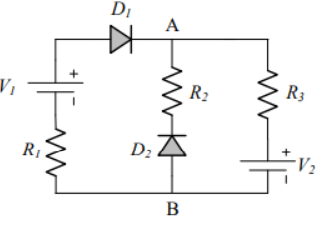

# Esercizio 4 – Analisi del punto di lavoro (Ponte Asimmetrico)

[🏠 Torna alla Home](./) | [← Esercizio 3](esercizio3)

---

## 🔗 Soluzione Completa
Per scaricare il PDF con la soluzione formale e i passaggi estesi:
👉 **[Apri la soluzione su Overleaf](https://www.overleaf.com/read/ngwfkrtyscpy#cc4ee5)**

---

## 📐 1. Analisi dello Schema

In questo esercizio analizziamo un circuito a "ponte" alimentato da due generatori di tensione.

*(Fig. 1: Schema circuitale. File: esercizio4.png)*

**Dati del problema:**
* Resistori: **R1 = 1 kΩ**, **R2 = 10 kΩ**, **R3 = 10 kΩ**
* Generatori: **V1 = 15 V**, **V2 = 10 V**
* Diodi (Modello a soglia): **Von = 0.6 V**

**Obiettivo:**
Trovare la tensione e corrente su **D1** e **D2**, e calcolare la tensione differenziale **VAB** (ovvero Va - Vb).

---

## 🧠 2. Metodo degli Stati

Come da prassi, ipotizziamo lo stato dei diodi.
Osservando che **V1 (15V) > V2 (10V)**, è probabile che la corrente scorra da sinistra verso destra attraverso **D1**.
**D2** invece si trova su un ramo che potrebbe essere a potenziale inferiore rispetto al nodo A.

### Ipotesi: D1 ON, D2 OFF

1.  **D1 ON:** Sostituito da batteria **0.6V**.
2.  **D2 OFF:** Sostituito da circuito aperto (**I = 0**).

---

## 3️⃣ Svolgimento

Con **D2 aperto**, il ramo centrale (R2) non conduce corrente. Il circuito diventa un'unica maglia esterna:
> **V1 → R1 → D1 → R3 → V2**

### A. Calcolo della Corrente ID1
Applicando la legge di Kirchhoff alla maglia:

> **ID1 = (V1 - Von - V2) / (R1 + R3)**

Sostituendo i numeri:
> ID1 = (15V - 0.6V - 10V) / (1kΩ + 10kΩ)
> ID1 = 4.4V / 11kΩ = **0.4 mA**

✅ **Verifica:** La corrente è positiva (>0), quindi **D1 è effettivamente ON**.

### B. Calcolo della Tensione su D2 (Verifica OFF)
Dobbiamo assicurarci che la tensione ai capi di D2 sia minore di 0.6V.
La tensione su D2 è data dalla differenza di potenziale tra Anodo (B) e Catodo (A).
*Nota: Poiché I=0 su quel ramo, non c'è caduta su R2.*

Applicando la legge delle tensioni (LKT) alla maglia destra inferiore:
> **VD2 = -V2 - (R3 · ID1)**

> VD2 = -10V - (10kΩ · 0.4mA)
> VD2 = -10V - 4V = **-14V**

✅ **Verifica:** -14V è minore di 0.6V. Il diodo D2 è polarizzato inversamente, quindi è **OFF**.

---

## 4️⃣ Risultato: Tensione VAB

Dobbiamo trovare la differenza di potenziale tra il nodo A e il nodo B.

1.  **Nodo B:** Essendo il ramo di D2 aperto e collegato a massa nello schema (o riferimento basso), e non scorrendo corrente in R2:
    **VB = 0V**

2.  **Nodo A:** Possiamo calcolarlo partendo da V2 e risalendo la resistenza R3:
    **VA = V2 + (R3 · ID1)**
    VA = 10V + (10kΩ · 0.4mA) = 10V + 4V = **14V**

*(Verifica partendo da V1: VA = 15V - (1kΩ · 0.4mA) - 0.6V = 14V)*.

### Calcolo Finale
> **VAB = VA - VB = 14V - 0V = 14V**

---

    

        <h2 id="q-title">🔒 Esercizio 4 Bloccato</h2>
        
Rispondi correttamente per visualizzare la soluzione.

        

        
Caricamento domanda...

        

        

    

